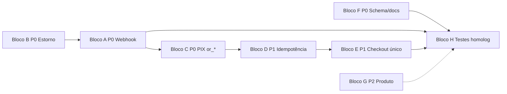

# Plano — Manutenção assinatura B2B (restaurante → Pubfy / Pagar.me)

**Branch sugerida:** `fix/pagarme-subscription-integrity` (ou continuar na branch ativa)
**Status geral:** planejado — aguardando implementação
**Última atualização:** 2026-06-05
**Origem:** análise de código do fluxo de assinatura (ignorando dados de teste no banco)

**Documentos relacionados:**
- `docs/INTEGRACOES_PAGARME.md` — visão técnica
- `docs/ROTEIRO_PAGARME_HOMOLOGACAO_PRODUCAO.md` — homologação sandbox → live
- `docs/SUPORTE_PROBLEMAS_COMUNS.md` — incidentes

---

## Como usar este roteiro

1. Marque **`[x]`** quando a tarefa estiver **concluída** e testada.
2. Marque **`[~]`** quando estiver **parcialmente concluída** (anote o que falta na coluna Observação do registro de execução).
3. Deixe **`[ ]`** para pendente.
4. Cada bloco tem **critério de aceite** e **roteiro de teste** — não avance de bloco sem validar o anterior quando houver dependência.
5. Após cada bloco, registre data e observações na **seção 9 (Registro de execução)**.

### Legenda de prioridade

| Tag | Significado |
|-----|-------------|
| **P0** | Integridade de dinheiro/estado — corrigir antes de escalar clientes pagantes |
| **P1** | Confiabilidade operacional |
| **P2** | Profissionalização de produto, UX e manutenibilidade |

### Arquivos principais do fluxo

| Área | Caminhos |
|------|----------|
| Edge — cartão | `supabase/functions/pagarme-create-subscription/index.ts` |
| Edge — boleto/PIX | `supabase/functions/pagarme-create-boleto-pix/index.ts` |
| Edge — gestão | `supabase/functions/pagarme-update-subscription/index.ts` |
| Edge — webhook | `supabase/functions/pagarme-webhook/index.ts` |
| Shared | `supabase/functions/_shared/pagarme-*.ts` |
| RPC | `supabase/migrations/*insert_paid_checkout_subscription*` |
| Banco/migrations | `supabase/migrations/*plans*pagarme_payment_methods*`, `src/integrations/supabase/types.ts` |
| Front checkout | `src/components/payment/PaymentForm.tsx` |
| Front confirmação | `src/components/payment/PixPaymentConfirmation.tsx`, `BoletoPaymentConfirmation` |
| Front assinaturas | `src/pages/Assinaturas.tsx`, `src/hooks/usePendingSubscriptionPoll.ts` |
| Serviço | `src/services/pagarmeSubscriptionService.ts` |

---

## 1. Contexto resumido (o que a análise encontrou)

### O que já está bom (não quebrar ao refatorar)

- Secrets só no backend; checkout exige owner (ou super-admin).
- Cartão recusado → HTTP 402 sem ativar plano.
- RPC `insert_paid_checkout_subscription` — ativação atômica no cartão pago.
- Trial local (sem duplicar trial no plano remoto).
- Boleto recorrente via `sub_*`; webhook + poll como rede de segurança.
- Entitlement via `get_restaurant_subscription_entitlement`.

### Modelo real por método de pagamento

| Método | Objeto Pagar.me | Renovação automática |
|--------|-----------------|----------------------|
| Cartão | `sub_*` (direto `POST /subscriptions`) | Sim |
| Boleto | `sub_*` | Sim |
| PIX assinatura | `or_*` (pedido avulso) | **Não** — 1 período por pagamento |

### Divergência doc × código

`INTEGRACOES_PAGARME.md` descreve cartão como order-first; o código atual cria **`sub_*` direto**. Alinhar na **Bloco F**.

### Separação crítica para o webhook

O handler `processPlatformSubscriptionOrderPayment` deve processar apenas eventos de cobrança avulsa da
assinatura da plataforma (`order.*` / `charge.*` com `or_*` ou metadata de pedido). Eventos de recorrência
com `subscription_id` / `subscription.id` `sub_*` precisam cair no handler genérico de `charge`/`invoice`.
Do contrário, uma renovação de cartão/boleto pode ser engolida pelo caminho de pedido avulso.

---

## 2. Ordem sugerida de implementação



**Sequência recomendada:** B → A → C → D → E → F → H → G (G pode ser paralelo após H).

---

## Bloco A — P0: Webhook não reativa assinaturas canceladas

**Objetivo:** `order.paid` / `charge.paid` não pode marcar `active` em linha já `canceled` ou duplicar entitlement.

**Arquivo principal:** `supabase/functions/pagarme-webhook/index.ts` (`processPlatformSubscriptionOrderPayment`)

### Tarefas

- [ ] **A1** Antes de `update`, carregar `subscriptions.status` e abortar (log + auditoria) se `status NOT IN ('pending')` para eventos `paid`.
- [ ] **A2** Se `paid` chegar para `canceled`: registrar em `pagarme_webhook_events.processing_error` ou campo de nota; **não** alterar status local.
- [ ] **A3** Garantir que `supersedePriorSubscriptions` só roda quando transição válida `pending → active`.
- [ ] **A4** Adicionar teste manual documentado no roteiro (cenário “PIX antigo pago após cancelamento”).
- [ ] **A5** Se o evento tiver `subscription_id`/`subscription.id` `sub_*`, `processPlatformSubscriptionOrderPayment` deve retornar `false` para o handler genérico processar renovação, falha, estorno e invoice.
- [ ] **A6** Adicionar teste unitário/fixture para `charge.paid` de recorrência com metadata `source = pubfy_platform_subscription` e `subscription_id = sub_*`.

### Critério de aceite

- Pagamento tardio de checkout cancelado **não** ativa plano nem altera `get_restaurant_subscription_entitlement`.
- `charge.paid`/`invoice.paid` de `sub_*` continua atualizando assinatura recorrente normalmente.

### Roteiro de teste (homologação)

1. Criar assinatura PIX → obter QR → **não pagar**.
2. Iniciar novo checkout (cartão ou outro PIX) → confirmar que pending anterior foi cancelado localmente (após Bloco C) ou cancelar manualmente via UI.
3. Pagar o QR **antigo** (se ainda existir no Pagar.me).
4. Verificar: assinatura local permanece `canceled`; entitlement não muda para `active` indevido.

```sql
SELECT id, status, pagarme_subscription_id, last_payment_at
FROM subscriptions
WHERE restaurant_id = '<uuid>'
ORDER BY created_at DESC
LIMIT 5;
```

---

## Bloco B — P0: Estorno (`refunded`) e falhas de pagamento

**Objetivo:** estorno no Pagar.me reflete no Pubfy; assinatura não fica `active` indevidamente.

**Arquivo principal:** `pagarme-webhook/index.ts`

### Tarefas

- [ ] **B1** Tratar `charge.refunded` / status `refunded` no handler de assinatura plataforma → `status = 'canceled'` (ou `past_due` se política comercial exigir grace).
- [ ] **B2** Atualizar `last_payment_status`, `end_date` e campos de período conforme regra de negócio.
- [ ] **B3** Confirmar que `get_restaurant_subscription_entitlement` revoga acesso após estorno (ajustar RPC se necessário).
- [ ] **B4** Documentar política: estorno = fim imediato vs. fim no `current_period_end`.

### Critério de aceite

- Simular/refletir estorno → restaurante perde entitlement conforme política definida em B4.

### Roteiro de teste

1. Assinatura `active` (cartão ou PIX pago).
2. Disparar/refletir webhook `charge.refunded` (painel teste ou reprocesso admin).
3. Conferir status local e bloqueio de features premium.

---

## Bloco C — P0: Invalidar pedidos PIX (`or_*`) em novo checkout / cancelamento

**Objetivo:** pedido PIX antigo não permanece pagável após troca de método ou novo checkout.

**Arquivos:** `pagarme-create-subscription`, `pagarme-create-boleto-pix`, `pagarme-update-subscription`, possível helper em `_shared/`

### Tarefas

- [ ] **C1** Extrair `cancelStalePendingCheckoutAttempts` para `_shared` (ex.: `pagarme-cancel-stale-pending.ts`).
- [ ] **C2** Estender limpeza para IDs `or_*` / `ord_*`: cancelar ou fechar pedido no Pagar.me (`PATCH`/`DELETE` conforme API v5).
- [ ] **C3** Chamar helper no início de **cartão**, **boleto** e **PIX** checkout.
- [ ] **C4** Em `pagarme-update-subscription` `action: cancel`, cancelar pedido remoto quando `pagarme_subscription_id` for `or_*`.
- [ ] **C5** Mapear erro da API se pedido já pago/expirado — não falhar checkout novo por isso.
- [ ] **C6** Incluir metadata explícita nos pedidos PIX: `payment_method: 'pix'` e `checkout_model: 'one_time_pix_subscription_period'`.
- [ ] **C7** No webhook, promover `or_* → sub_*` somente quando metadata indicar checkout inicial de cartão/order-first. PIX pago deve ativar apenas o período local, sem chamar `createRecurringSubscriptionAfterCardOrder`.
- [ ] **C8** Adicionar teste unitário/fixture para `order.paid` PIX: status local vira `active`, `pagarme_subscription_id` permanece `or_*` (ou migra para `pagarme_order_id` após G3), e nenhuma recorrência é criada.

### Critério de aceite

- Novo checkout cancela pendências locais **e** referências remotas `sub_*` e `or_*`.
- Cancelamento pelo usuário fecha pedido PIX aberto no Pagar.me (quando API permitir).
- PIX confirmado ativa exatamente um período pago e não cria assinatura recorrente falsa.

### Roteiro de teste

1. Checkout PIX → pending com `or_*`.
2. Novo checkout cartão (ou boleto) no mesmo restaurante.
3. Confirmar: pending anterior `canceled`; no painel Pagar.me pedido antigo cancelado/fechado.
4. Repetir com `action: cancel` na UI de gestão.

---

## Bloco D — P1: Idempotência e reprocesso de webhooks/API

**Objetivo:** eventos não ficam travados; duplicatas não corrompem estado.

**Arquivo principal:** `pagarme-webhook/index.ts`, opcional `pagarme-webhook-admin`

### Tarefas

- [ ] **D1** Se `event_id` ausente: deduplicar por hash (`type` + `data.id` + timestamp) antes de processar.
- [ ] **D2** Corrigir lógica em `acquireWebhookEventLog`: evento inserido mas não processado **sem** `processing_error` deve poder reprocessar após timeout (ex.: 5 min).
- [ ] **D3** Em falha de processamento: gravar `processing_error`; avaliar 5xx só para erros transientes (documentar decisão).
- [ ] **D4** Backend admin: reprocessar também eventos B2B (`subscription.*`, `invoice.*`, `charge.*` de assinatura plataforma), não só reconciliação de pedido B2C. Ideal: extrair `processEvent` para `_shared` e reutilizar em `pagarme-webhook-admin`.
- [ ] **D5** Corrigir `healPaidPlatformOrderWithoutLocalRow` para não assumir `payment_method: credit_card` em pedidos PIX.
- [ ] **D6** Enviar `Idempotency-Key` nas operações críticas do Pagar.me (`POST /customers`, cards, `POST /subscriptions`, `POST /orders`) usando um `checkout_attempt_id` local estável.
- [ ] **D7** Persistir tentativas de checkout ou, no mínimo, registrar idempotency key em metadata/local log para auditoria de duplicidade.

### Critério de aceite

- Crash simulado no meio do webhook → evento reprocessável sem duplicar assinatura ativa.
- Healing de pedido PIX pago sem linha local funciona.
- Retry/timeout do frontend ou Edge Function não cria duas cobranças/assinaturas para a mesma tentativa.

### Roteiro de teste

1. Forçar `processing_error` em evento de teste.
2. Reprocessar via admin/script.
3. Verificar idempotência (mesmo `event_id` duas vezes → um efeito só).

---

## Bloco E — P1: Um checkout pendente por restaurante

**Objetivo:** evitar múltiplos `pending` e estado confuso na UI.

**Arquivos:** edges de checkout, `PaymentForm.tsx`, `Assinaturas.tsx`, opcional RPC

### Tarefas

- [ ] **E1** API: retornar **409** se já existir `pending` para o restaurante (exceto fluxo “retomar pagamento” explícito).
- [ ] **E2** UI: detectar `pending` e oferecer “Continuar pagamento” (QR/boleto) ou “Cancelar e tentar de novo”.
- [ ] **E3** Alinhar com Bloco C (cancelar stale antes de novo checkout automático vs. bloqueio explícito — escolher uma política e documentar).
- [ ] **E4** `sync_payment` e webhook: garantir `supersedePriorSubscriptions` em **todos** os caminhos `pending → active` (revisão cruzada).

### Critério de aceite

- Usuário não consegue abrir 3 PIX pendentes simultâneos sem ação consciente.
- Ativação sempre deixa uma única assinatura entitlement.

### Roteiro de teste

1. Tentar segundo checkout com pending aberto → 409 ou fluxo de retomada.
2. Pagar um pending → apenas uma linha `active`; demais `canceled`.

---

## Bloco F — P0/P1: Schema, documentação e copy alinhados ao código

**Objetivo:** migrations limpas, homologação e suporte sem surpresas.

### Tarefas

- [ ] **F0** Criar migration para atualizar `plans_pagarme_payment_methods_check` e incluir `pix` na lista permitida.
- [ ] **F0.1** Validar que uma base limpa consegue aplicar `20260523120000_seed_homolog_pix_plan_1_real.sql` sem violar constraint.
- [ ] **F0.2** Confirmar que Admin Add/Edit Planos permite salvar `pix`, mas `pagarme-sync-plan` continua removendo `pix` do payload de plano recorrente Pagar.me (correto).
- [ ] **F1** Atualizar `INTEGRACOES_PAGARME.md`: cartão = `POST /subscriptions` direto; PIX assinatura = `or_*` sem renovação; order→`sub_*` só legado.
- [ ] **F2** Corrigir copy PIX homologação: **R$ 5,00 (500 centavos)** — não “R$ 500”.
  - `src/components/payment/PaymentForm.tsx`
  - `src/components/payment/PixPaymentConfirmation.tsx`
  - `docs/ROTEIRO_PAGARME_HOMOLOGACAO_PRODUCAO.md` (se divergir)
- [ ] **F3** Adicionar seção “PIX assinatura = renovação manual” na UI (`PaymentForm` ou `Assinaturas`).
- [ ] **F4** Atualizar `docs/SUPORTE_PROBLEMAS_COMUNS.md` com cenários: pending eterno, PIX pago após cancelamento, estorno.
- [ ] **F5** Atualizar `scripts/pagarme-homologation-smoke.mjs`: remover/verificar corretamente a suposição antiga “cartão cria recorrência após pedido pago”; adicionar checks para constraint `pix` e docs alinhados.

### Critério de aceite

- Base limpa aceita planos com `pagarme_payment_methods` contendo `pix`.
- Textos de UI batem com `pagarme-plan-pricing.ts` (cap 500 centavos em `sk_test`).
- Novo dev entende os três fluxos lendo só `INTEGRACOES_PAGARME.md`.

---

## Bloco G — P2: Profissionalização produto e código

**Objetivo:** SaaS maduro — comunicação, schema e higiene de código.

### Tarefas

- [ ] **G1** Lembrete antes do fim do período para assinaturas PIX (`email-dispatch` ou campanha) + CTA “Renovar plano”.
- [ ] **G2** Banner quando `usePendingSubscriptionPoll` expira (5 min) sem confirmação.
- [ ] **G3** Migration: separar `pagarme_order_id` vs `pagarme_subscription_id` (ou `checkout_type` enum) — parar de guardar `or_*` no campo de subscription.
- [ ] **G4** Mover helpers de comprovante de `supabase/functions/_shared` para `src/lib/pagarme-receipt.ts` (ou duplicar interface mínima).
- [ ] **G5** Remover ou isolar legado: `src/hooks/useAssinatura.ts`, `src/services/payment/*` (marcar `@deprecated` se ainda referenciado).
- [ ] **G6** Consolidar idempotência implementada no Bloco D em um padrão reutilizável para futuras integrações de pagamento.
- [ ] **G7** Job/healing: assinatura ativa no Pagar.me + falha no RPC local → reconciliação periódica ou endpoint admin.

### Critério de aceite

- Renovação PIX é comunicada ao lojista; código legado não confunde novos contribuidores.

---

## Bloco H — Homologação integrada (Definition of Done)

**Objetivo:** provar o fluxo completo após blocos A–F (mínimo) antes de live.

### Pré-requisitos

- [ ] **H0** Planos sincronizados em `sk_test` (`pagarme-sync-plan`).
- [ ] **H0** Webhook ativo com `signature_valid = true` em eventos de teste.

### Matriz de cenários

| # | Cenário | Blocos relacionados | Status |
|---|---------|---------------------|--------|
| H1 | Cartão sucesso `4000000000000010` → `active` + entitlement | — | [ ] |
| H2 | Cartão recusado `4000000000000028` → 402, sem `active` | — | [ ] |
| H3 | Boleto pending → webhook/poll → `active` | D, E | [ ] |
| H4 | PIX ≤ R$ 5 homolog → `active` + `or_*` | F | [ ] |
| H5 | PIX > R$ 5 homolog → falha esperada | F | [ ] |
| H6 | Troca PIX → cartão; PIX antigo não reativa (A + C) | A, C | [ ] |
| H7 | Estorno pós-ativo (B) | B | [ ] |
| H8 | Cancelamento com acesso até fim do período | — | [ ] |
| H9 | Troca mensal ↔ anual (`change_plan`) com `sub_*` | — | [ ] |
| H10 | Plano não sincronizado → 409 no checkout | — | [ ] |
| H11 | Plano com `pix` salvo via Admin em base limpa/migration nova | F | [ ] |
| H12 | `charge.paid` recorrente `sub_*` não é engolido pelo handler de `or_*` | A, D | [ ] |

### Comandos úteis

```bash
npm run typecheck
npm run test
npm run pagarme:smoke-homolog
```

```sql
-- Webhooks recentes
SELECT event_type, signature_valid, processed, processing_error, created_at
FROM pagarme_webhook_events
ORDER BY created_at DESC LIMIT 15;

-- Assinaturas do restaurante
SELECT id, status, billing_cycle, pagarme_subscription_id,
       last_payment_status, current_period_end, next_billing_at
FROM subscriptions
WHERE restaurant_id = '<uuid>'
ORDER BY created_at DESC;
```

### Critério de aceite global

- [ ] **H-OK** Matriz H1–H10 marcada em homologação (`sk_test`).
- [ ] **H-OK** Nenhum P0 (blocos A, B, C) pendente antes de cutover live.
- [ ] **H-OK** `docs/ROTEIRO_PAGARME_HOMOLOGACAO_PRODUCAO.md` atualizado com referência a este plano.

---

## 8. Riscos e decisões de produto (registrar antes de codar)

| # | Decisão | Opções | Escolha atual |
|---|---------|--------|---------------|
| R1 | Estorno revoga acesso | Imediato vs. fim do período | _A definir_ |
| R2 | Segundo checkout com pending | Bloquear 409 vs. auto-cancelar stale | _A definir_ |
| R3 | Renovação PIX | Manual + lembrete vs. forçar cartão/boleto | Manual (código atual) |
| R4 | Pedido PIX expirado no Pagar.me | Ignorar webhook vs. tratar como failed | _A definir_ |
| R5 | Idempotência | Tabela `checkout_attempts` vs. metadata/log leve | _A definir_ |
| R6 | Reprocesso admin | Reusar `processEvent` completo vs. ações separadas por tipo | _A definir_ |

Preencher a coluna **Escolha atual** antes de implementar B1 e E1.

---

## 9. Registro de execução

| Data | Bloco / Item | Status | Observação |
|------|--------------|--------|------------|
| 2026-06-04 | Plano criado | — | Roteiro derivado da análise de assinatura B2B |
| 2026-06-05 | Revisão de coerência | parcial | Adicionadas lacunas: separação `or_*`/`sub_*` no webhook, constraint `pix`, reprocesso B2B e idempotência |
| | | | |

**Status possíveis:** `concluído` · `parcial` · `bloqueado` · `n/a`

---

## 10. Referências rápidas

| Tópico | Onde ler |
|--------|----------|
| Cap PIX homolog (500 centavos) | `supabase/functions/_shared/pagarme-plan-pricing.ts` |
| Ativação atômica cartão | `insert_paid_checkout_subscription` (migration `20260523142000`) |
| Entitlement | RPC `get_restaurant_subscription_entitlement` |
| Poll pending | `src/hooks/usePendingSubscriptionPoll.ts` (8s, 5 min) |
| Metadata assinatura plataforma | `source: pubfy_platform_subscription` nos pedidos PIX |
| Constraint métodos plano | `plans_pagarme_payment_methods_check` deve permitir `pix` |
| Idempotência Pagar.me | `Idempotency-Key` por tentativa de checkout |
