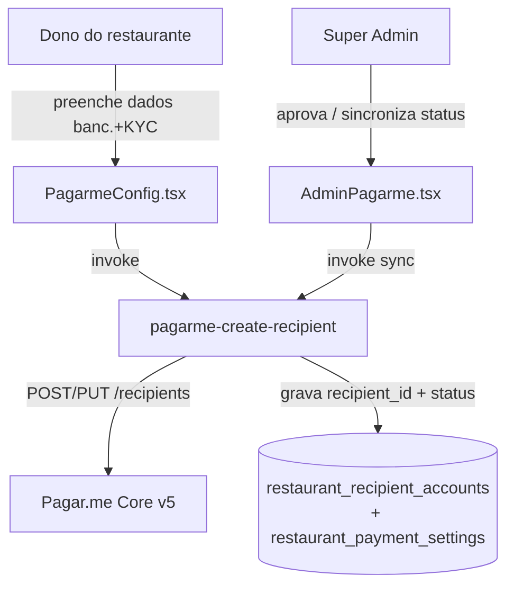

# Plano — Onboarding do recebedor (repasse PIX para o restaurante)

**Branch:** `feature/pagarme-recipient-onboarding`
**Status geral:** em implementação
**Última atualização:** 2026-06-04

---

## 1. Contexto e problema

Hoje o PIX do cliente final (pedido do cardápio) é cobrado na conta Pagar.me **da plataforma (Pubfy)** e repassado ao restaurante via **split** para um `recipient_id` (recebedor do Pagar.me). O modelo de repasse escolhido é **automático** (a liquidação na conta bancária do restaurante é feita pelo Pagar.me, conforme as `transfer_settings` do recebedor).

**Gaps identificados na análise:**

1. **Criação do recebedor é 100% manual e externa.** O super-admin digita um `rp_...` na mão em `AdminPagarme.tsx`. Não existe fluxo que colete os dados bancários/KYC do restaurante e crie o recebedor no Pagar.me. Não escala e é a principal causa de confusão sobre "como o dinheiro chega no lojista".
2. **O lojista não informa a conta bancária dentro do produto.** `PagarmeConfig.tsx` só tem um botão "Solicitar ativação".
3. (Fora do escopo desta entrega) Não há painel financeiro (saldo/extrato/saque) para o lojista — tratado em plano futuro.

**Decisões fechadas com o produto:**

- Modelo de liquidação: **repasse automático** via split → recebedor (Pagar.me liquida direto na conta do restaurante).
- Prioridade desta entrega: **onboarding do recebedor** (coletar dados bancários + KYC e criar o `recipient` no Pagar.me automaticamente).

---

## 2. Objetivo desta entrega

Permitir que o **dono do restaurante** preencha, dentro do Pubfy, os dados necessários (titular + conta bancária + documento) e que o sistema **crie/atualize automaticamente o recebedor no Pagar.me**, gravando o `recipient_id` e o status de KYC. O super-admin passa a **acompanhar e aprovar** com base nesses dados, em vez de digitar o `rp_...` manualmente.

### Fora de escopo (próximas entregas)
- ~~Painel financeiro do lojista (saldo, extrato, liquidações).~~ → **Entregue** (ver seção 7).
- Saque manual / antecipação configurável pelo lojista.
- Cartão de crédito online no cardápio.
- Webhook de `recipient`/KYC do Pagar.me para atualizar status automaticamente (faremos sincronização sob demanda nesta entrega; webhook fica como melhoria).

---

## 3. Arquitetura proposta

- **PII isolada:** dados bancários e documentos ficam numa tabela dedicada (`restaurant_recipient_accounts`) com RLS estrita; nunca trafegam para o público.
- **Secret única:** a edge function usa `PAGARME_SECRET_KEY` (plataforma). O lojista nunca informa chave de API.
- **Idempotência:** se já existe `recipient_id`, a function atualiza o recebedor/conta em vez de criar duplicado.

---

## 4. Checklist de tarefas

### Banco de dados
- [x] **DB-1** Migration: tabela `restaurant_recipient_accounts` (dados do titular, documento, conta bancária, `recipient_id`, `recipient_status`, `kyc_status`, `last_response`, timestamps) com RLS. → `supabase/migrations/20260604190000_pagarme_recipient_onboarding.sql`
- [x] **DB-2** Migration: colunas auxiliares em `restaurant_payment_settings` (`recipient_status`, `recipient_synced_at`) para refletir o estado sem expor PII.
- [x] **DB-3** Atualizar `src/integrations/supabase/types.ts` com as novas estruturas.

### Backend (Edge Function)
- [x] **EF-1** Criar `supabase/functions/pagarme-create-recipient/index.ts`: autentica dono/super-admin, valida payload, cria/atualiza recipient no Pagar.me, persiste no banco.
- [x] **EF-2** Suportar ação `sync_status` (consulta `GET /recipients/{id}` e atualiza status local).
- [x] **EF-3** Registrar a function em `supabase/config.toml` (`verify_jwt = true`).
- [x] **EF-4** Reaproveitar helpers de erro (`_shared/pagarme-errors.ts`) e observabilidade.

### Frontend
- [x] **FE-1** `src/services/restaurantRecipientService.ts`: tipos + invoke das ações (`submit`, `sync`).
- [x] **FE-2** `PagarmeConfig.tsx`: formulário de onboarding (titular, documento, conta bancária) com validação; substitui o botão genérico "Solicitar ativação".
- [x] **FE-3** `AdminPagarme.tsx`: exibir status do recebedor/KYC, dados resumidos, botão "Sincronizar status"; `recipient_id` preenchido automaticamente (com override manual mantido).

### Qualidade / entrega
- [x] **QA-1** `npm run typecheck` verde; sem erros de lint nos arquivos alterados.
- [ ] **QA-2** Revisão de RLS e de não-exposição de PII no fluxo público.
- [ ] **QA-3** Atualizar `docs/INTEGRACOES_PAGARME.md` e o roteiro de homologação com o novo fluxo.
- [ ] **QA-4** Itens de homologação (criar recebedor de teste, validar split com recebedor real).
- [x] **DEPLOY** Aplicar migration e fazer deploy da function `pagarme-create-recipient` no projeto Supabase.

---

## 5. Notas / riscos

- **KYC do Pagar.me é assíncrono:** após criar o recebedor, o status pode ficar `registration`/`affiliation`/`active`. O split só funciona com recebedor apto. Por isso `onboarding_status` local começa em `pending` e só vai a `approved` quando o recebedor estiver `active` (sincronização manual nesta entrega; webhook depois).
- **Simulador PIX + Split:** conforme doc Pagar.me, o simulador de PIX pode não funcionar com split — validar em homologação com recebedor real de teste.
- **Bug pré-existente — CORRIGIDO:** imports faltantes adicionados em
  `pagarme-create-order-payment/index.ts` (`buildPagarmeOrderLineItems`, `toCents`) e em
  `pagarme-webhook/index.ts` (`reconcileOrderPaymentFromPagarme`, `PagarmeOrderPaymentData`).
  Sem isso, o webhook de `order.*` e a criação de PIX de pedido lançavam `ReferenceError` em runtime.

---

## 7. Entrega 2 — Painel financeiro do lojista

**Objetivo:** dar visibilidade do dinheiro recebido e do saldo, dentro do produto.

### Checklist
- [x] **FIN-DB/EF** Edge function `pagarme-recipient-financials`: consulta `GET /recipients/{id}/balance`
  (saldo disponível, a liberar, transferido) e `GET /recipients/{id}/transfers` (liquidações). Registrada em `config.toml`.
- [x] **FIN-SVC** `src/services/recipientFinancialsService.ts`: saldo via edge function + extrato a partir de `order_payments` (com número/cliente do pedido) e resumo (total recebido, pedidos pagos, ticket médio).
- [x] **FIN-UI** Página `src/pages/Recebimentos.tsx`: cards de resumo, saldo Pagar.me, transferências e extrato com filtro de período (7/30/90 dias).
- [x] **FIN-NAV** Rota `/recebimentos` (`AppRoutes.tsx`) + item "Recebimentos" no menu (`DashboardSidebar.tsx`).
- [x] **FIN-QA** `npm run typecheck` verde; sem lints.
- [ ] **FIN-DEPLOY** Deploy da function `pagarme-recipient-financials` e teste com recebedor real.

### Observações
- O extrato usa dados locais (`order_payments`) — sempre disponível mesmo sem recebedor ativo.
- O saldo/transferências dependem do recebedor já criado no Pagar.me; sem recebedor, a UI mostra aviso e só o extrato.
- Saque/antecipação não estão expostos (liquidação é automática `Daily`); ficam como evolução futura.

---

## 8. Backlog de refinamentos (pendências)

> Itens identificados na autorrevisão (04/06/2026). Marcar `[x]` conforme forem concluídos.

### Bloco A — KYC completo do recebedor (CRÍTICO, bloqueia produção real)

Confirmado na doc oficial ([Criar recebedor](https://docs.pagar.me/reference/criar-recebedor-1) e
[mudanças de contrato v5](https://docs.pagar.me/page/novas-regras-para-criação-de-sellers-de-marketplace-c-v5)):
desde fev/2024 (Circular 3.978/20 Bacen) a criação de recebedor exige o objeto `register_information`
**completo**. Hoje a function só envia `phone_numbers` — em `sk_live` a criação tende a ser **recusada**.

- [x] **A1** Form PF: coletar `birthdate`, `mother_name`, `monthly_income`, `professional_occupation` e endereço completo (rua, número, complemento, bairro, cidade, estado, CEP, ponto de referência). → `RecipientOnboardingForm.tsx`
- [x] **A2** Form PJ: coletar `company_name`/`trading_name`, `annual_revenue`, endereço da empresa e ao menos um `managing_partners` (sócio) com KYC próprio (nome, documento, nascimento, nome da mãe, renda, ocupação, endereço, `self_declared_legal_representative`). → `RecipientOnboardingForm.tsx`
- [x] **A3** Edge `pagarme-create-recipient`: montar `register_information` (PF/PJ) conforme contrato v5; mover `name/email/document/type` para dentro de `register_information`. → `_shared/pagarme-recipient-register.ts`
- [x] **A4** Persistir os novos campos (migration: ampliar `restaurant_recipient_accounts` ou tabela de endereço/KYC) com RLS. → `20260605100000_recipient_kyc_fields.sql` + `types.ts`
- [x] **A5** Tratar mensagens de erro de validação da Pagar.me por campo na UI. → `RecipientSubmitError` + lista `field_errors` no form
- [ ] **A6** Homologar criação real PF e PJ até `status = active`.

### Bloco B — Extrato: valor bruto x líquido

- [x] **B1** Renomear no extrato/cards o que hoje é bruto (ex.: “Valor dos pedidos”) para não sugerir líquido. → cards “Bruto dos pedidos”, coluna “Bruto”
- [x] **B2** Calcular e exibir o **líquido repassado** (descontar comissão da plataforma e taxas Pagar.me) — usar split aplicado e/ou dados do `order_payments.raw_response`. → `orderPaymentBreakdown.ts` + `recipientFinancialsService`
- [x] **B3** Coluna/somatório separando bruto, comissão e líquido. → tabela com 4 colunas + linha de totais em `Recebimentos.tsx`

### Bloco C — Sincronização automática do status do recebedor

- [x] **C1** Tratar eventos de `recipient`/KYC no `pagarme-webhook` (atualizar `recipient_status` + `onboarding_status`). → `recipient.*` + `_shared/pagarme-recipient-status.ts`
- [x] **C2** Poll leve após o cadastro (ex.: a cada 30s por alguns minutos) até sair de `registration`. → `useRecipientStatusPoll` em `PagarmeConfig`
- [x] **C3** Notificar o lojista quando o recebedor ficar `active` (e quando for `refused`). → e-mail (`recipient_activated`/`recipient_refused`) + alertas no sino do dashboard

### Bloco D — Validações e navegação

- [ ] **D1** Validação real de CPF/CNPJ (dígitos verificadores) no form e na edge.
- [ ] **D2** Validação de banco/agência/conta (lista de bancos, formato).
- [ ] **D3** Suporte a atualizar dados do titular (não só a conta bancária) em recebedor existente (`PUT /recipients/{id}`).
- [ ] **D4** Link cruzado entre “Recebimentos Online” (config) e “Recebimentos” (financeiro).

### Bloco E — Operacional / deploy

- [ ] **E1** Aplicar migration `20260604190000_pagarme_recipient_onboarding.sql` no projeto Supabase.
- [ ] **E2** Deploy das functions `pagarme-create-recipient` e `pagarme-recipient-financials`.
- [ ] **E3** Garantir secrets `PAGARME_SECRET_KEY`, `PAGARME_WEBHOOK_SECRET` e `PAGARME_PLATFORM_RECIPIENT_ID` (se houver comissão).
- [ ] **E4** Validar split com recebedor real (lembrar: simulador PIX não funciona com split).

### Bloco F — Documentação

- [x] **F1** Atualizar `docs/INTEGRACOES_PAGARME.md` com onboarding de recebedor + painel financeiro.
- [ ] **F2** Atualizar `docs/ROTEIRO_PAGARME_HOMOLOGACAO_PRODUCAO.md` com bloco de homologação do recebedor (PF/PJ, KYC, saldo).
- [ ] **F3** Adicionar cenários de suporte em `docs/SUPORTE_PROBLEMAS_COMUNS.md` (recebedor recusado, saldo zerado, repasse não caiu).

---

## 6. Registro de execução

| Data | Item | Observação |
|------|------|------------|
| 2026-06-04 | Branch + plano | Branch `feature/pagarme-recipient-onboarding` criada e plano aprovado |
| 2026-06-04 | DB + EF + FE | Migration, edge function, serviço e UIs (lojista + admin) implementados; `npm run typecheck` verde |
| 2026-06-04 | Bugfix imports | Corrigidos imports faltantes em `pagarme-create-order-payment` e `pagarme-webhook` |
| 2026-06-04 | Painel financeiro | Edge `pagarme-recipient-financials`, serviço, página `/recebimentos` e item de menu; typecheck verde |
| 2026-06-04 | Backlog + docs | Backlog de refinamentos (blocos A–F) documentado; `INTEGRACOES_PAGARME.md` atualizado |
| 2026-06-05 | Bloco A KYC | Migration KYC, edge com `register_information` completo, `RecipientOnboardingForm` PF/PJ, `field_errors` na UI |
| 2026-06-05 | Bloco B extrato | Bruto/comissão/taxa/líquido no extrato e cards de resumo (`orderPaymentBreakdown.ts`) |
| 2026-06-05 | Bloco C sync | Webhook `recipient.*`, poll 30s×10, e-mail e notificações do painel |
