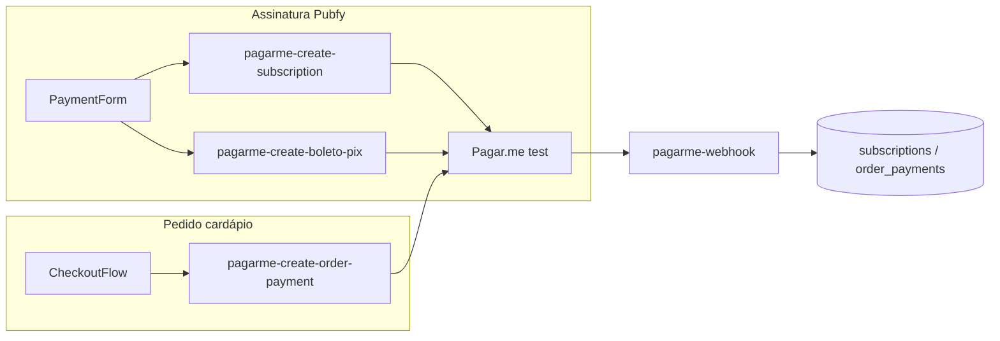

# Roteiro de homologação e produção — Pagar.me (Pubfy)

**Objetivo:** validar, com os **simuladores** da Pagar.me em ambiente de teste, todos os fluxos de cobrança do Pubfy (assinaturas da plataforma + PIX online no cardápio) e só então fazer o **cutover para produção** com chaves `live`, webhooks e planos sincronizados.

**Ambiente de teste atual (referência):** conta **FalconPDV - Test** / **Loja de teste** no painel Pagar.me; webhook ativo apontando para  
`https://jyrfjvyeikhqpuwcvdff.supabase.co/functions/v1/pagarme-webhook` (conforme print de 29/04/2026).

**Como usar este documento**

- Marque **`[x]`** em cada item conforme for executando (homologação ou go-live).
- Itens em **“Pendência de produto”** são gaps conhecidos no código — devem ser corrigidos **antes** de considerar boleto/assinatura 100% prontos para produção comercial ampla.
- Use em conjunto com: `docs/RUNBOOK_PRODUCAO.md` (secrets e webhooks), `docs/QA_ROTEIROS_MANUAIS.md` (personas) e `docs/SUPORTE_PROBLEMAS_COMUNS.md` (incidentes).

---

## Decisões fechadas (resumo executivo)

| Tema | Decisão |
|------|---------|
| API | Pagar.me **Core v5** (`https://api.pagar.me/core/v5`) |
| Segredos | `PAGARME_SECRET_KEY`, `PAGARME_WEBHOOK_SECRET`, `PAGARME_PLATFORM_RECIPIENT_ID` apenas em **Supabase Edge secrets** (nunca no bundle Vite) |
| Assinatura Pubfy | Edge Functions server-side; front **não** chama API com secret |
| Planos | Todo plano vendável precisa de `pagarme_plan_id_monthly` / `pagarme_plan_id_yearly` via sync (Super Admin) |
| Cartão assinatura | `pagarme-create-subscription` → customer + card + subscription |
| Boleto assinatura | `pagarme-create-boleto-pix` (nome legado; hoje só `boleto`) |
| PIX assinatura | **Não implementado** no fluxo atual (ver Pendências) |
| PIX pedido (cardápio) | `pagarme-create-order-payment` + webhook `charge.paid` / `order.paid` |
| Webhook | Obrigatório para boleto, PIX de pedido e renovações; assinatura HMAC com `PAGARME_WEBHOOK_SECRET` e fallback `PAGARME_SECRET_KEY` |
| Homologação | Chave `sk_test_…` + simuladores habilitados em [id.pagar.me](https://id.pagar.me/) → Configurações → Meios de pagamento |
| Produção | Chave `sk_live_…` + webhook recriado/atualizado no painel **produção** + planos re-sincronizados no ambiente live |

---

## Revisão de conformidade com o sistema (repo — maio/2026)

### Edge Functions (mapa)

| Função | Papel | JWT Supabase |
|--------|--------|----------------|
| `pagarme-create-subscription` | Assinatura com cartão | Validado no handler (`Authorization: Bearer`) |
| `pagarme-create-boleto-pix` | Assinatura com boleto | Idem |
| `pagarme-update-subscription` | Cancelar / trocar ciclo | Idem |
| `pagarme-get-receipt` | Comprovante / cobranças | Idem |
| `pagarme-sync-plan` | Criar/atualizar planos no Pagar.me | Super Admin |
| `pagarme-webhook` | Eventos assíncronos | `verify_jwt = false` (correto) |
| `pagarme-create-order-payment` | PIX de pedido do cardápio | `verify_jwt = true` |

Arquivos: `supabase/functions/pagarme-*/index.ts`.

### Frontend

| Área | Arquivo principal |
|------|-------------------|
| Checkout assinatura | `src/components/payment/PaymentForm.tsx` |
| Serviço assinatura | `src/services/pagarmeSubscriptionService.ts` |
| Página assinaturas | `src/pages/Assinaturas.tsx` |
| Comprovante | `src/components/assinaturas/SubscriptionReceiptView.tsx` |
| PIX cardápio | `src/components/public-menu/checkout/CheckoutFlow.tsx` + `src/services/deliveryOrderService.ts` |
| Pagamento online loja | `src/pages/PagarmeConfig.tsx` |
| Super Admin | `src/pages/admin/AdminPagarme.tsx`, `AdminPagarmeWebhooks.tsx`, `AdminPlanos.tsx` |

### Código legado (não usar em homologação)

`src/services/payment/*` + `config.ts` (`apiKey: 'test_api_key'`) — mocks antigos de chamada **direta** no browser. O fluxo real passa pelas Edge Functions acima.

### Banco de dados

- `subscriptions` — status, `pagarme_subscription_id`, `pagarme_customer_id`, períodos, pagamentos.
- `pagarme_webhook_events` — auditoria, `signature_valid`, `processed`, `processing_error`.
- `plans` — `pagarme_plan_id_*`, `pagarme_sync_status`, `pagarme_payment_methods`.
- `restaurant_payment_settings` — PIX online por restaurante (marketplace / split).
- `order_payments` — cobranças de pedidos do cardápio.

RPC relevante: `get_my_subscription_summaries` — **não** retorna assinaturas com status `pending` (ver Pendências).

---

## Simuladores Pagar.me — referência rápida

Documentação oficial: [O que é um simulador](https://docs.pagar.me/docs/o-que-%C3%A9-um-simulador).

**Seleção no painel:** [id.pagar.me](https://id.pagar.me/) → **Configurações → Meios de pagamento** → escolher simulador (Gateway “Simulator” e/ou PSP, conforme tipo de conta).

### Cartão de crédito (assinatura e cobranças)

| Número (teste) | Cenário |
|----------------|---------|
| `4000000000000010` | Sucesso |
| `4000000000000028` | Falha / não autorizado |
| `4000000000000036` | Processing → depois sucesso |
| `4000000000000044` | Processing → depois falha |
| `4000000000000077` | Sucesso → processing → sucesso |
| `4000000000000093` | Sucesso → processing → sucesso (1ª operação) |

Use **validade futura** (ex.: `12/30`) e CVV qualquer (ex.: `123`).

Fonte: [Simulador de cartão de crédito](https://docs.pagar.me/docs/simulador-de-cart%C3%A3o-de-cr%C3%A9dito).

### PIX (pedidos — não assinatura)

| Valor da transação | Cenário |
|--------------------|---------|
| ≤ R$ 500,00 | Sucesso: `pending` → em segundos `paid` (simulação automática) |
| > R$ 500,00 | Falha: `failed` |

Fonte: [Simulador PIX](https://docs.pagar.me/docs/simulador-pix).  
**Nota:** simulador PIX **não** funciona com Split ativo — validar modo marketplace do restaurante.

### Boleto

Consultar regras em [Simulador de boleto](https://docs.pagar.me/docs/simulador-de-boleto). Em geral a assinatura/cobrança nasce `pending` até confirmação; o Pubfy depende do webhook `charge.paid` / `invoice.paid`.

---

## Visão dos blocos (ordem sugerida)

| Bloco | Nome | Depende de |
|-------|------|------------|
| A | Infraestrutura sandbox | — |
| B | Planos sincronizados | A |
| C | Assinatura — cartão | B |
| D | Assinatura — boleto | B |
| E | Webhooks e auditoria | C, D |
| F | PIX — cardápio público | A, E |
| G | Admin marketplace / recipients | A |
| H | Cenários de falha (simulador) | C, D, F |
| I | Pendências de código (pré-produção) | — |
| J | Cutover produção | A–H, I |
| K | QA final e monitoramento pós-go-live | J |



---

## Bloco A — Infraestrutura sandbox

**Objetivo:** garantir que o ambiente de teste está completo antes de qualquer fluxo de pagamento.

### A1. Secrets no Supabase

Projeto: `jyrfjvyeikhqpuwcvdff` (ou o projeto ativo).

- [ ] `PAGARME_SECRET_KEY` = chave **de teste** (`sk_test_…`) — você indicou que já está configurada.
- [ ] `PAGARME_WEBHOOK_SECRET` definido e **igual** ao “Sign with Secret” do webhook no painel Pagar.me (homologação).
- [ ] `PAGARME_PLATFORM_RECIPIENT_ID` preenchido se for usar **split** em pedidos do cardápio (obrigatório quando `marketplace_mode = split`).

Validação:

```bash
npm run preflight:prod
```

Esperado: checks de `PAGARME_*` documentados em `.env.example` passam (secrets precisam existir no remoto; o script valida presença na documentação e código, não o valor).

### A2. Painel Pagar.me (loja de teste)

- [ ] Banner **“Loja de teste”** visível (vendas simuladas).
- [ ] Em **Configurações → Meios de pagamento**: simuladores de **cartão**, **boleto** e **PIX** habilitados conforme o tipo de conta (Gateway vs PSP).
- [ ] Chaves de API de teste copiadas apenas para o Supabase (não commitar).

### A3. Webhook (homologação)

Com base na sua configuração:

- [ ] URL: `https://jyrfjvyeikhqpuwcvdff.supabase.co/functions/v1/pagarme-webhook`
- [ ] Status: **active**
- [ ] Envio bloqueado: **false**
- [ ] Eventos mínimos assinados (recomendado manter os que você já tem):
  - Assinatura: `subscription.*`
  - Cobrança: `charge.paid`, `charge.payment_failed`, `charge.pending`, `charge.processing`, `charge.refunded`
  - Fatura: `invoice.paid`, `invoice.payment_failed`
  - Pedido (cardápio): `order.paid`, `order.payment_failed`, `charge.*` ligados a pedidos

Teste de segurança (deve falhar):

```bash
curl -i -X POST "https://jyrfjvyeikhqpuwcvdff.supabase.co/functions/v1/pagarme-webhook" \
  -H "Content-Type: application/json" \
  -d '{"type":"charge.paid","data":{}}'
```

Esperado: **HTTP 401** e `{"error":"Invalid signature"}`.

Teste real: no painel Pagar.me → Webhooks → **Enviar teste** (ou disparar evento após uma cobrança de teste).

### A4. Super Admin no Pubfy

- [ ] Usuário super admin consegue acessar `/admin/pagarme` e `/admin/planos`.
- [ ] Painel de webhooks em Admin lista eventos (`pagarme_webhook_events`).

**Evidência sugerida:** print ou `event_id` do último evento com `signature_valid = true`.

---

## Bloco B — Planos sincronizados com Pagar.me

**Objetivo:** todo plano vendido no Pubfy existe no Pagar.me com IDs mensal/anual.

### B1. Sync no Super Admin

- [ ] Abrir **Admin → Planos** → para cada plano ativo: **Sincronizar com Pagar.me** (`pagarme-sync-plan`).
- [ ] Conferir no banco:

```sql
SELECT id, name, pagarme_sync_status, pagarme_plan_id_monthly, pagarme_plan_id_yearly, pagarme_payment_methods
FROM plans
WHERE is_active = true;
```

Esperado: `pagarme_sync_status = 'synced'` e ambos os IDs preenchidos (ou justificar plano só mensal).

- [ ] `pagarme_payment_methods` inclui os métodos do plano (ex.: `credit_card`, `boleto`, `pix`).
- [ ] Após adicionar PIX a um plano existente: **re-sincronizar** no Admin (IDs Pagar.me do plano precisam incluir PIX).

### B2. Validação negativa

- [ ] Tentar assinar plano **sem** sync → UI/Edge retorna erro **409** com mensagem para sincronizar no Super Admin primeiro.

**Arquivo:** `pagarme-create-subscription/index.ts` (mesma checagem em `pagarme-create-boleto-pix`).

---

## Bloco C — Assinatura com cartão de crédito

**Persona:** dono do restaurante em trial ou inativo.  
**Rota:** `/assinaturas` → escolher plano → **Cartão**.

### C1. Sucesso (`4000000000000010`)

- [ ] Preencher nome, e-mail, CPF, telefone (DDD + número, só dígitos na API).
- [ ] Cartão: `4000000000000010`, validade `12/30`, CVV `123`.
- [ ] Toast de sucesso; aba **Visão geral** mostra alerta **“Plano ativo”** (ou **“Em teste”** se o plano tiver `trial_days` e Pagar.me retornar `trialing`).
- [ ] SQL:

```sql
SELECT id, status, billing_cycle, pagarme_subscription_id, pagarme_customer_id, next_billing_at
FROM subscriptions
WHERE restaurant_id = '<uuid_do_restaurante>'
ORDER BY created_at DESC
LIMIT 3;
```

Esperado: `status IN ('active','trialing')`, `pagarme_subscription_id` preenchido.

- [ ] Painel Pagar.me: assinatura criada na loja de teste.
- [ ] `pagarme_webhook_events`: eventos `subscription.*` / `charge.paid` com `signature_valid = true`, `processed = true`.

### C2. Falha (`4000000000000028`)

- [ ] Mesmo fluxo com cartão de falha.
- [ ] Esperado: erro amigável no toast; **nenhuma** assinatura nova `active` no banco.

### C3. Processing (opcional, recomendado)

- [ ] Cartão `4000000000000036` ou `4000000000000077`.
- [ ] Observar se o webhook atualiza `subscriptions.status` e `last_payment_status` após alguns segundos.
- [ ] Conferir e-mail transacional `subscription_receipt` se `charge.paid` (template em `pagarme-webhook`).

### C4. Gestão pós-assinatura

- [ ] **Gerenciar assinatura**: cancelar (`pagarme-update-subscription`) → status `canceled` local após webhook ou resposta imediata.
- [ ] **Comprovante** (`SubscriptionReceiptView` / `pagarme-get-receipt`): exibe última cobrança paga.

---

## Bloco D — Assinatura com boleto

**Rota:** `/assinaturas` → **Boleto**.

### D1. Criação

- [ ] Concluir formulário (sem dados de cartão).
- [ ] Edge `pagarme-create-boleto-pix` retorna `success: true` e objeto `payment` com `boleto_url` / `boleto_line` quando a API enviar na primeira fatura.

**Comportamento esperado (pós-correção I1–I3):**

- [ ] Tela de confirmação com link do boleto e linha digitável.
- [ ] Status local `pending` até webhook de pagamento.
- [ ] Alerta “Aguardando confirmação do pagamento” em `/assinaturas`.

### D2. Pagamento simulado

- [ ] No painel Pagar.me, localizar cobrança/assinatura `pending` e simular pagamento (conforme doc do simulador de boleto).
- [ ] Aguardar webhook `charge.paid` ou `invoice.paid`.
- [ ] SQL: `subscriptions.status` deve ir para `active`; `last_payment_at` preenchido.

### D3. Acesso durante pendência

- [ ] Com boleto pendente: alerta laranja, **sem** alerta verde “Plano ativo”.
- [ ] `get_restaurant_subscription_entitlement` **não** libera produto até `active`.

---

## Bloco D-Pix — Assinatura com PIX

**Pré-requisito:** plano com `pix` em `pagarme_payment_methods` e sync no Pagar.me.

**Rota:** `/assinaturas` → aba **PIX**.

### D-Pix1. Sucesso (valor do plano ≤ R$ 500 no simulador)

- [ ] Escolher ciclo mensal cujo total ≤ R$ 500 (ajustar preço do plano em Admin se necessário).
- [ ] Concluir formulário → tela com QR Code e copia e cola.
- [ ] SQL: `status = 'pending'` logo após criar; após simulação automática, `status = 'active'`.
- [ ] Webhook `charge.paid` em `pagarme_webhook_events`.

### D-Pix2. Falha (valor > R$ 500)

- [ ] Plano anual/mensal com total > R$ 500 → erro ou `failed` conforme simulador.
- [ ] Nenhuma assinatura `active` indevida.

---

## Bloco E — Webhooks e auditoria

**Objetivo:** provar que eventos chegam, são autenticados e atualizam o banco.

### E1. Tabela de auditoria

```sql
SELECT event_type, signature_valid, processed, processing_error, created_at
FROM pagarme_webhook_events
ORDER BY created_at DESC
LIMIT 20;
```

- [ ] Após testes dos Blocos C e D: linhas recentes com `signature_valid = true`.
- [ ] `processing_error` nulo nos eventos processados com sucesso.
- [ ] Nenhum volume anormal de `rejected.invalid_signature` (indicaria secret divergente).

### E2. Admin

- [ ] `/admin/pagarme` → aba Webhooks: lista coerente com a query acima.
- [ ] Reprocessar manualmente (se houver UI) apenas após entender `processing_error` — ver `docs/SUPORTE_PROBLEMAS_COMUNS.md` §2.1.

### E3. Mapeamento de status (referência)

| Evento Pagar.me | Efeito em `subscriptions` |
|-----------------|---------------------------|
| `charge.paid` / `invoice.paid` | `active` + `last_payment_at` |
| `charge.payment_failed` | `past_due` |
| `charge.refunded` | `canceled` |
| `subscription.canceled` | `canceled` |

Implementação: `supabase/functions/pagarme-webhook/index.ts`.

---

## Bloco F — PIX no cardápio público (pedido)

**Pré-requisitos**

- [ ] Restaurante com `restaurant_payment_settings.onboarding_status = 'approved'`.
- [ ] `is_enabled = true`, `enabled_methods` contém `pix`.
- [ ] Fulfillment permitido (delivery/retirada/mesa conforme config em `PagarmeConfig` ou Admin).
- [ ] Super Admin definiu `recipient_id` se split estiver ativo.

### F1. PIX sucesso (valor ≤ R$ 500)

- [ ] Cardápio público → montar pedido com total **≤ R$ 500** (ex.: R$ 45,90).
- [ ] Pagamento **PIX online** → QR Code exibido (`AcompanharPedido` ou passo checkout).
- [ ] Em até ~1–2 min (simulador): status do pedido sai de `aguardando_pagamento` para fluxo de cozinha (`pendente`).
- [ ] SQL:

```sql
SELECT op.status, op.provider_charge_id, o.status, o.payment_status
FROM order_payments op
JOIN orders o ON o.id = op.order_id
WHERE op.order_id = '<uuid>'
ORDER BY op.created_at DESC
LIMIT 1;
```

Esperado: `op.status = 'paid'`, `o.payment_status = 'paid'`.

### F2. PIX falha (valor > R$ 500)

- [ ] Pedido com total **> R$ 500** (ajustar itens/quantidades).
- [ ] Esperado: falha na criação do pagamento ou `payment_failed` / `pagamento_falhou` após webhook.
- [ ] Estoque (se ativo): política de estorno em `pagamento_falhou` — ver `docs/ROTEIRO_ESTOQUE_OPCIONAL.md` Bloco D.

### F3. Janela de 30 minutos

- [ ] Pedido criado há mais de 30 min não deve gerar novo PIX (`pagarme-create-order-payment` retorna erro de janela expirada).

---

## Bloco G — Admin marketplace (opcional no MVP)

**Objetivo:** validar split/comissão se a operação comercial usar marketplace.

- [ ] **Admin → Pagar.me**: selecionar restaurante → `recipient_id`, `onboarding_status = approved`, comissão se aplicável.
- [ ] Dono em **Configurações → Integrações / Pagamento online** (`PagarmeConfig`): ativar PIX nos modos de entrega desejados.
- [ ] Confirmar que **cartão online** no cardápio continua desabilitado na UI (`disabled: true` em `PagarmeConfig`) — comportamento esperado no código atual.
- [ ] Se usar split: lembrar limitação do simulador PIX + Split (doc Pagar.me).

---

## Bloco H — Matriz de cenários de falha (simulador)

Execute após Blocos C–F para aumentar confiança.

| # | Cenário | Como simular | Resultado esperado no Pubfy |
|---|---------|--------------|----------------------------|
| H1 | Cartão recusado | `4000000000000028` | Erro na criação; sem assinatura ativa |
| H2 | Cartão processing → OK | `4000000000000036` | Webhook eventual; status coerente |
| H3 | Boleto não pago | Não pagar boleto | Permanecer pendente/atraso conforme regra de negócio (após I1–I3) |
| H4 | PIX alto valor | Pedido > R$ 500 | `failed` / pedido não segue |
| H5 | Webhook secret errado | Alterar secret só no Supabase | `signature_valid = false`, 401 |
| H6 | Plano não sincronizado | Remover ID do plano no DB (só em teste) | HTTP 409 na Edge |
| H7 | Cancelar assinatura | UI Gerenciar → Cancelar | `canceled` + fim de acesso conforme regra comercial |

---

## Bloco I — Pendências de código (antes de produção comercial ampla)

### I1. Status `pending` gravado como `active` (boleto)

- [x] `mapPagarmeSubscriptionStatus` em `supabase/functions/_shared/pagarme-subscription-status.ts`.
- [x] Cancelamento de assinaturas anteriores inclui `pending`.
- [ ] Revalidar Bloco D (boleto) em homologação após deploy.

### I2. UI não exibe boleto após criar assinatura

- [x] `BoletoPaymentConfirmation` + passo pós-submit em `PaymentForm.tsx`.
- [x] Cópia de linha digitável e link do PDF.

### I3. Assinatura `pending` invisível para o dono

- [x] Migration `20260519143000_subscription_pending_visibility.sql`.
- [x] `useMySubscriptions`, alertas e badges em Assinaturas / Overview / Lista.

### I4. PIX em assinaturas

- [x] Edge `pagarme-create-boleto-pix` aceita `payment_method: pix` + `pix.expires_in`.
- [x] `PaymentForm` com aba PIX e `PixPaymentConfirmation` (QR + copia e cola).
- [x] Admin planos: método PIX em Add/Edit + sync Pagar.me.
- [ ] Homologar: plano com PIX habilitado → re-sync → assinatura com valor ≤ R$ 500 (simulador).

### I5. Remover ou isolar código legado `src/services/payment/*`

- [x] `paymentService.ts` marcado `@deprecated`; fluxo real usa `pagarmeSubscriptionService`.

### I6. Documentar cartões de teste no QA

- [x] `docs/QA_ROTEIROS_MANUAIS.md` §1.4 com link para este roteiro.

---

## Bloco J — Cutover para produção

**Objetivo:** trocar test → live sem downtime de cobrança.

### J1. Pré-cutover (checklist)

- [ ] Blocos A–H concluídos em **homologação**.
- [x] Pendências I1–I3 implementadas no código (revalidar em homologação).
- [ ] `npm run preflight:prod`, `npm run typecheck`, `npm run test` verdes.
- [ ] QA manual `docs/QA_ROTEIROS_MANUAIS.md` §1.4 e §2.2 (assinatura + PIX PDV/cardápio).

### J2. Pagar.me produção

- [ ] Criar/acessar conta **produção** (não “Loja de teste”).
- [ ] Gerar `sk_live_…` e configurar no Supabase:

```bash
supabase secrets set PAGARME_SECRET_KEY=sk_live_...
supabase secrets set PAGARME_WEBHOOK_SECRET=<novo_secret_producao>
```

- [ ] Cadastrar webhook **produção** com a **mesma URL** da Edge (ou URL de projeto prod se diferente).
- [ ] Confirmar recipient live em `PAGARME_PLATFORM_RECIPIENT_ID`.

### J3. Re-sincronizar planos em live

- [ ] **Admin → Planos → Sincronizar** cada plano **no ambiente live** (IDs mensal/anual mudam entre test e live).
- [ ] Validar SQL dos IDs em produção.

### J4. Smoke pós-cutover (produção)

- [ ] Uma assinatura real de valor baixo **ou** primeiro cliente piloto monitorado.
- [ ] Um PIX real de valor simbólico em restaurante piloto.
- [ ] Webhook em live com `signature_valid = true`.
- [ ] Rotacionar/confirmar que **não** restou `sk_test` no Supabase de produção (`docs/SUPORTE_PROBLEMAS_COMUNS.md` §2.2).

### J5. Rollback

- [ ] Manter chave `sk_test` anotada em cofre (não no repo) para voltar homologação.
- [ ] Procedimento: reverter secrets Supabase + desativar webhook live + comunicar clientes em trial.

---

## Bloco K — QA final e monitoramento

### K1. Roteiros manuais

- [ ] `docs/QA_ROTEIROS_MANUAIS.md` — seções **1.4 Assinatura** e **2.2 Pagamento online**.
- [ ] Registrar bugs no final do arquivo QA.

### K2. Monitoramento (primeiras 72h)

- [ ] Sentry: erros em `pagarme-create-*` e `pagarme-webhook`.
- [ ] Query diária:

```sql
SELECT count(*) FILTER (WHERE NOT signature_valid) AS invalid,
       count(*) FILTER (WHERE signature_valid AND NOT processed) AS stuck
FROM pagarme_webhook_events
WHERE created_at > now() - interval '24 hours';
```

- [ ] Alertar se `stuck > 0` ou pico de `invalid`.

### K3. Suporte

- [ ] Time treinado em `docs/SUPORTE_PROBLEMAS_COMUNS.md` §2 (assinatura) e §3.3 (pedido preso em pagamento).

---

## Critérios de aceite globais (Definition of Done — pagamentos)

- [ ] Nenhuma secret `PAGARME_*` no repositório ou no bundle frontend.
- [ ] Plano ativo no Pubfy sempre tem par de IDs Pagar.me (mensal/anual) no ambiente correspondente (test/live).
- [ ] Assinatura com cartão aprovada reflete `active`/`trialing` e webhook auditado.
- [ ] Boleto só libera experiência “plano pago” após confirmação de pagamento (após I1–I3).
- [ ] PIX de cardápio ≤ R$ 500 em teste conclui em `paid` com pedido operável.
- [ ] Webhook rejeita payload sem assinatura (401).
- [ ] Cutover live documentado com re-sync de planos e smoke real.
- [ ] Runbook e suporte atualizados.

---

## Registro de execução (preencher na homologação)

| Data | Executor | Blocos concluídos | Ambiente | Observações |
|------|----------|-------------------|----------|-------------|
| | | A / B / C / … | test | |
| | | J (cutover) | live | |

---

## Referências internas

| Documento | Uso |
|-----------|-----|
| `docs/RUNBOOK_PRODUCAO.md` | Secrets, URLs, validação curl webhook |
| `docs/QA_ROTEIROS_MANUAIS.md` | Personas e regressão geral |
| `docs/SUPORTE_PROBLEMAS_COMUNS.md` | Incidentes assinatura e PIX |
| `docs/INTEGRACOES_PAGARME.md` | Resumo técnico por canal |
| `.env.example` | Lista de variáveis |

---

**Última atualização:** 2026-05-19 — Roteiro inicial de homologação Pagar.me (sandbox → produção), alinhado ao código e ao webhook configurado em `jyrfjvyeikhqpuwcvdff`.
